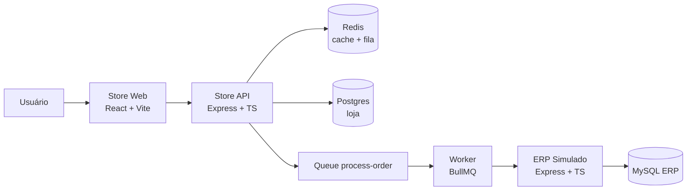
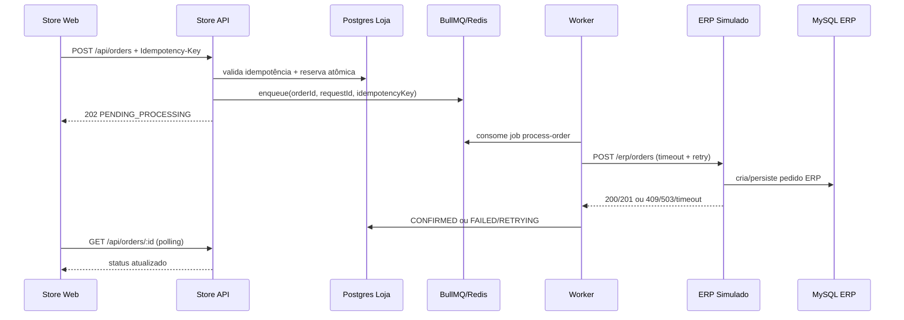

# Arquitetura CaseCellShop

## Visão geral

## Sequência de checkout

## Decisões principais
- Checkout não bloqueia no ERP.
- Estoque é protegido no banco da loja com operação atômica.
- Idempotência impede pedido duplicado em retries/double click.
- Worker centraliza integração instável com ERP.
